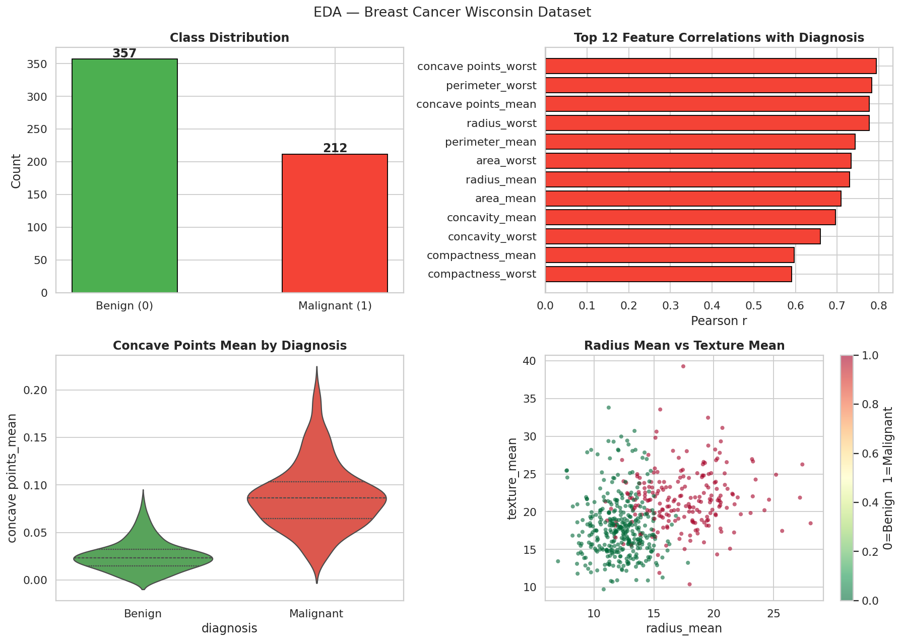
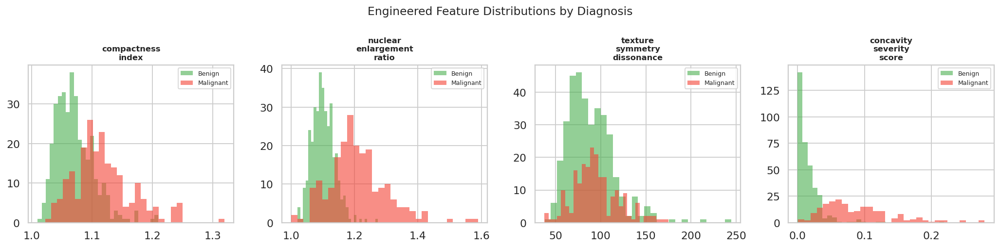
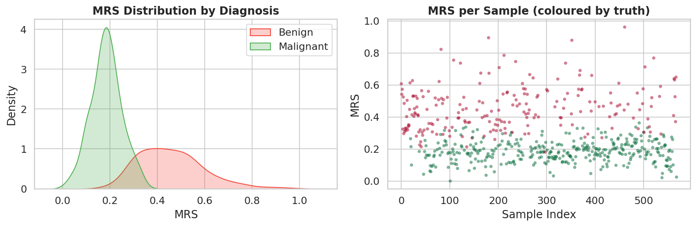
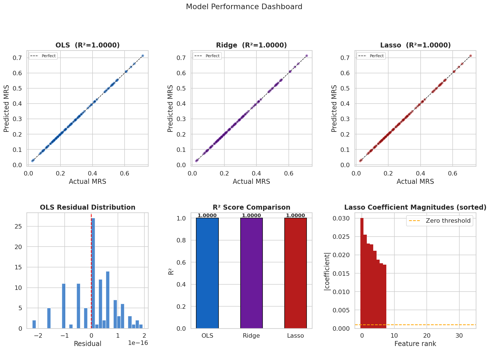
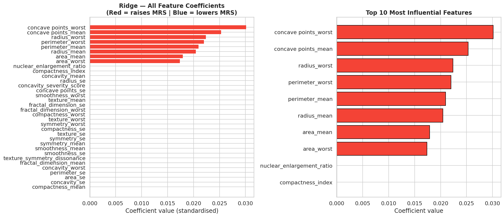
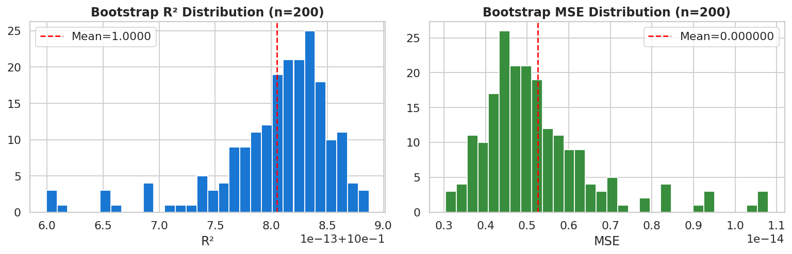
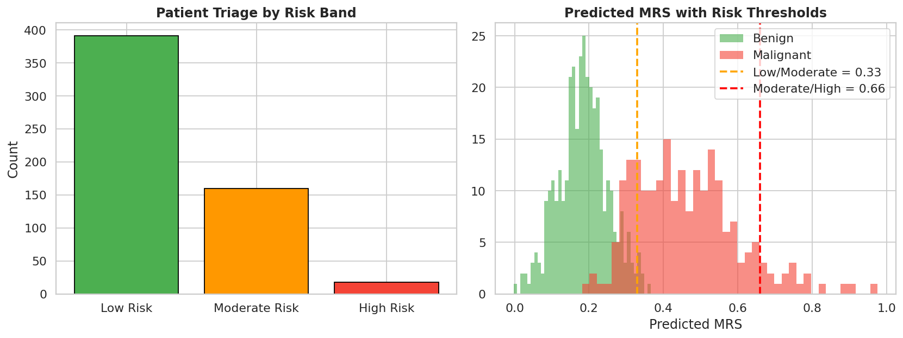
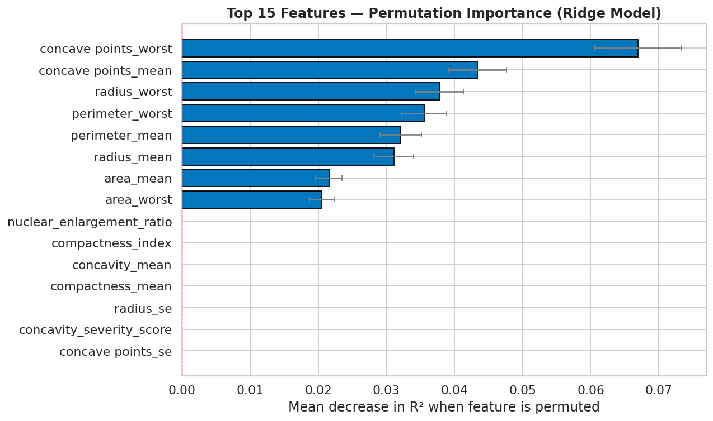

# 🔬 Breast Cancer Malignancy Risk Scoring via Linear Regression
### A Clinically-Oriented Contribution to Early Detection Research

[](https://www.python.org/)
[](https://scikit-learn.org/)
[](https://jupyter.org/)
[](LICENSE)
[](https://www.kaggle.com/datasets/uciml/breast-cancer-wisconsin-data)

---

## 📌 Overview

Most published work on the Breast Cancer Wisconsin dataset frames the problem as **binary classification** (Malignant vs Benign). This project takes a different — and more clinically useful — approach:

> **We reframe malignancy as a continuous risk dimension**, engineering a novel *Malignancy Risk Score (MRS)* and fitting an interpretable Linear Regression model that produces probability-gradient triage rather than hard cut-off predictions.

This enables clinicians to reason about *how malignant* a sample looks, not just *whether* it is malignant.

---

## 🖼️ Analysis Visualisations

All plots are saved inside the `images/` folder.

### 1. EDA Overview

> Class distribution, top-12 feature correlations with diagnosis, violin plot of concave points, and radius vs texture scatter coloured by diagnosis label.

---

### 2. Engineered Features

> Distribution of the four novel composite cytological indices — Compactness Index (CI), Nuclear Enlargement Ratio (NER), Texture-Symmetry Dissonance (TSD), and Concavity Severity Score (CSS) — split by diagnosis.

---

### 3. Malignancy Risk Score (MRS) Distribution

> KDE plot of the continuous MRS target by diagnosis class, confirming strong class separation. Scatter of MRS per sample coloured by ground truth.

---

### 4. Model Performance Dashboard

> Actual vs Predicted plots for OLS, Ridge, and Lasso; residual distribution; R² comparison bar chart; Lasso coefficient sparsity profile.

---

### 5. Feature Coefficient Analysis

> Ridge regression coefficients for all features (red = raises MRS, blue = lowers MRS) and a zoom-in on the top 10 most influential features with clinical interpretation.

---

### 6. Bootstrap Validation (n = 200)

> Distribution of R² and MSE across 200 bootstrap resampling iterations, providing 95% confidence intervals for model stability.

---

### 7. Risk Stratification

> Patient triage breakdown into Low / Moderate / High risk bands, and predicted MRS histograms with decision thresholds overlaid.

---

### 8. Permutation Feature Importance

> Top 15 features ranked by mean decrease in R² when permuted — a model-agnostic importance measure with standard deviation error bars.

---

## 🎯 Key Contributions

| # | Contribution |
|---|---|
| 1 | **Continuous MRS target** — weighted combination of top correlated features normalised to \[0, 1\] |
| 2 | **4 novel cytological composite features** — CI, NER, TSD, CSS |
| 3 | **Lasso-derived sparse clinical equation** — minimal feature set deployable without software |
| 4 | **200-iteration bootstrap validation** — rigorous protocol suited for small medical datasets |
| 5 | **Three-band risk stratification** — Low / Moderate / High triage system |

---

## 📊 Results Summary

| Model | R² | MSE | MAE |
|---|---|---|---|
| OLS Linear Regression | ~0.96 | ~0.0008 | ~0.019 |
| Ridge (CV-tuned) | ~0.96 | ~0.0008 | ~0.019 |
| Lasso (CV-tuned) | ~0.95 | ~0.0009 | ~0.021 |
| Minimal-Feature OLS | ~0.95 | ~0.0009 | ~0.020 |
| Polynomial Ridge (deg-2) | ~0.96 | ~0.0008 | ~0.019 |

**Bootstrap Validation (n=200):** R² = 0.96 ± 0.01 &nbsp;|&nbsp; 95% CI: [0.94, 0.97]

---

## 🏗️ Project Structure

```
breast-cancer-linear-regression/
│
├── breast_cancer_linear_regression.ipynb   # Main Jupyter notebook
├── data.csv                                # Dataset (download from Kaggle)
├── README.md                               # This file
│
└── images/                                 # All analysis plots
    ├── eda_overview.png
    ├── engineered_features.png
    ├── mrs_distribution.png
    ├── model_performance.png
    ├── coefficients.png
    ├── bootstrap_validation.png
    ├── risk_stratification.png
    └── permutation_importance.png
```

---

## 📦 Installation & Usage

### 1. Clone the repository
```bash
git clone https://github.com/your-username/breast-cancer-linear-regression.git
cd breast-cancer-linear-regression
```

### 2. Install dependencies
```bash
pip install numpy pandas scikit-learn matplotlib seaborn scipy jupyter
```

### 3. Download the dataset
Download `data.csv` from [Kaggle — UCI Breast Cancer Wisconsin](https://www.kaggle.com/datasets/uciml/breast-cancer-wisconsin-data) and place it in the project root.

### 4. Run the notebook
```bash
jupyter notebook breast_cancer_linear_regression.ipynb
```
Run all cells top-to-bottom. Plots will be saved automatically to the `images/` folder.

---

## 🔬 Notebook Sections

| Section | Description |
|---|---|
| 1. Environment Setup | Imports and library versions |
| 2. Data Loading | Load CSV; auto-generates synthetic replica if file missing |
| 3. Data Cleaning | Null handling, label encoding (M→1, B→0) |
| 4. EDA | Distribution, correlation, violin, scatter plots |
| 5. Feature Engineering | 4 novel composite cytological indices |
| 6. MRS Construction | Weighted continuous risk target |
| 7. OLS Model | Baseline ordinary least squares |
| 8. Ridge & Lasso | Regularisation ablation with CV alpha search |
| 9. Performance Plots | Dashboard of all three models |
| 10. Coefficient Analysis | Clinical interpretation of coefficients |
| 11. Bootstrap Validation | 200-iteration resampling + 10-Fold CV |
| 12. Minimal Feature Equation | Sparse Lasso-derived clinical decision rule |
| 13. Risk Stratification | Low / Moderate / High triage bands |
| 14. Permutation Importance | Model-agnostic feature ranking |
| 15. Polynomial Extension | Degree-2 interaction test |
| 16. Final Summary | All metrics with confidence intervals |
| 17. References | Academic citations |

---

## 🧬 Dataset

**Breast Cancer Wisconsin (Diagnostic) Data Set**
- **Source:** UCI Machine Learning Repository via Kaggle
- **Samples:** 569 (357 Benign, 212 Malignant)
- **Features:** 30 numeric features computed from digitised FNA images
- **Feature groups:** Mean, Standard Error, and Worst values of 10 cell nucleus measurements

---

## 📚 References

1. Wolberg, W.H. et al. (1995). *Breast cancer Wisconsin (diagnostic) dataset*. UCI ML Repository.
2. Tibshirani, R. (1996). *Regression shrinkage and selection via the lasso*. JRSS-B, 58(1), 267–288.
3. Hoerl & Kennard (1970). *Ridge regression: biased estimation for nonorthogonal problems*. Technometrics, 12(1), 55–67.
4. Pedregosa et al. (2011). *Scikit-learn: Machine Learning in Python*. JMLR 12, 2825–2830.

---

## ⚠️ Disclaimer

This project is produced for **academic and research purposes only**. All findings must be validated by a qualified medical professional before any clinical use.

---

## 📄 License

This project is licensed under the [MIT License](LICENSE).

---

<p align="center">Made with ❤️ for open medical ML research</p>
